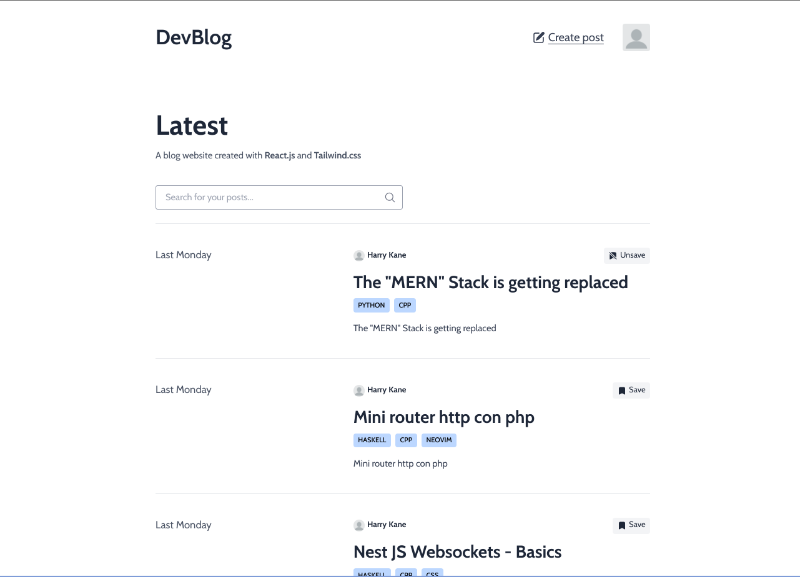
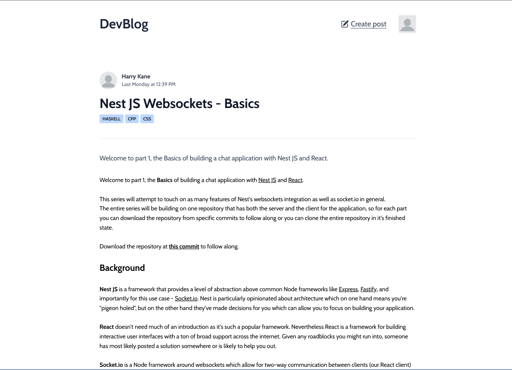
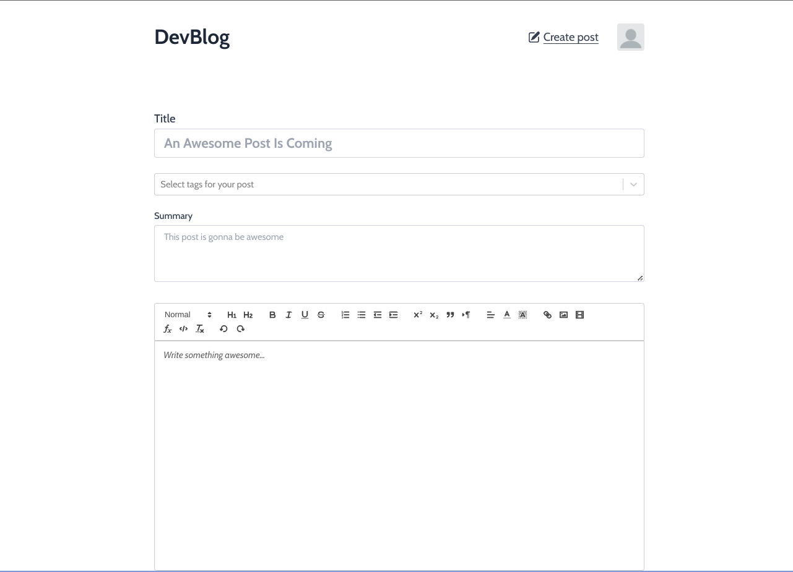
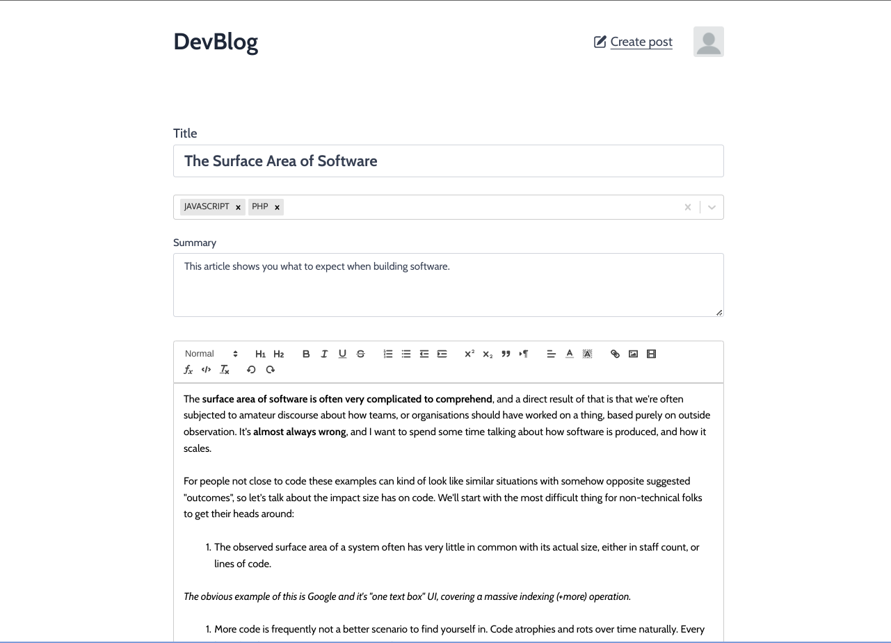
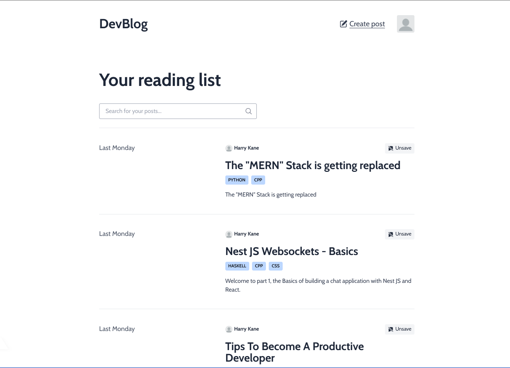
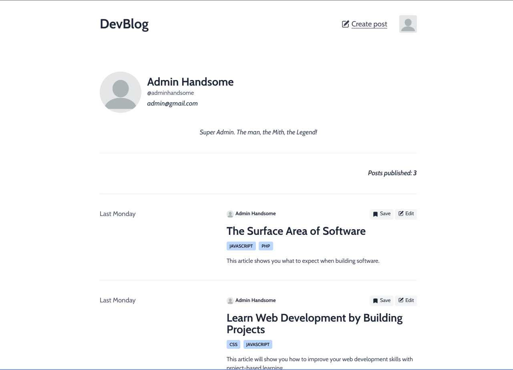
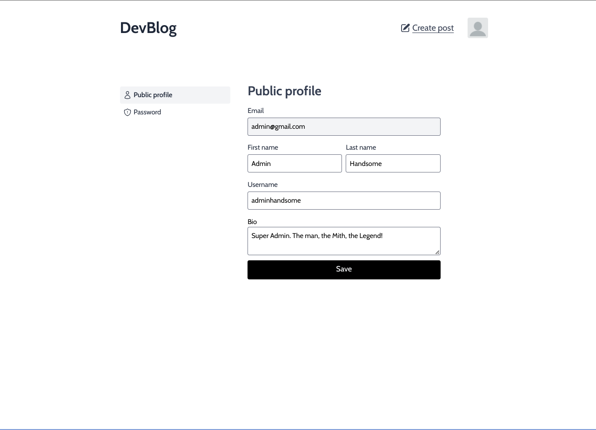
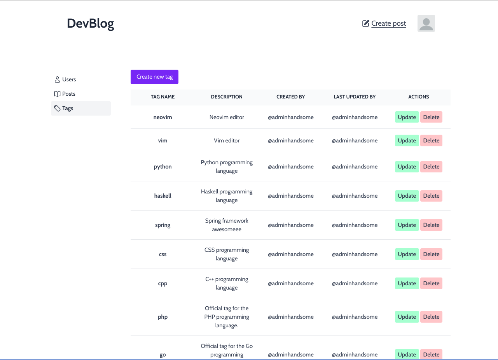

# DevBlog

## A Medium-like web app built with Reactjs

### Description

This is the front-end of Medium-like web app created with **Reactjs**, **Typescript**, **Redux Toolkit** and **Tailwind CSS**, where users can read or publish their own blog posts. You can find the back-end source code of the app [here](https://github.com/loc-cv/devblog-server).

### Overview

- Persist logged-in user with refresh token and RTK Query.
- Protected routes based on user role with React Router.
- Infinite scroll with react-infinite-scroll-component.
- Client-side form validation with React Hook Form and Zod.
- Pagination tables with React Table.
- Rich text editor using React Quill.
- Responsive design (kind of) with Tailwind CSS.

### Screen Shots

*Home Page*
 
 

*Single post page*
 
 

*User can create post*
 
 

*Of course user can edit their post*
 
 

*User can save posts for later reading*
 
 

*User profile page*
 
 

*User can update profile info and password*
 
 

*Admin can manage the app with Dashboard pages*

### Installation and Setup Instructions

In case you want to run this project locally, clone the repository to your local machine:

- Make sure you have correctly set up the [server](https://github.com/loc-cv/devblog-server).
- Make sure you have docker and docker-compose installed on your machine.
- Navigate to your cloned directory.
- run <code>docker-compose up</code>.

### Todo

- [ ] Add search posts by tags. The Backend already has API for this feature.
- [ ] User can report a post. The Backend also already has API for this.
- [ ] Users can follow each other.
- [ ] Implement notifications.
- [ ] Update user profile photo. This is not a hard task, but I'm too lazy right now ._.
